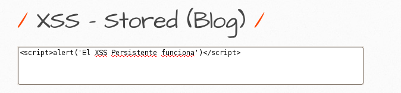
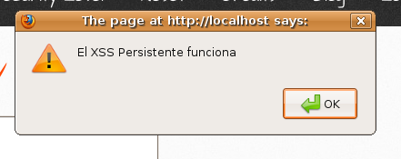

# `10` Vulnerable and outdated components

El propósito de este ejercicio es demostrar cómo los **componentes desactualizados y vulnerables** pueden ser explotados para realizar ataques como Cross-Site Scripting (XSS) Persistente. El uso de versiones antiguas o sin parches de bibliotecas de software, como una versión desactualizada de jQuery o un sistema de manejo de entradas mal implementado, facilita el abuso de vulnerabilidades ya conocidas.

En este ejercicio, utilizaremos el módulo Stored Blog de bWAPP para simular cómo un componente vulnerable permite la inyección y ejecución de código malicioso, demostrando así el impacto que puede tener el no mantener los componentes del software actualizados.

### Instrucciones

1. Selecciona la vulnerabilidad **Cross Site Scripting Stored (Blog)** y "Hack". Serás redirigido a una página con un campo donde los usuarios pueden dejar comentarios.
2. Escribe el siguiente código JavaScript para simular un ataque de XSS:

```bash
<script>alert('El XSS Persistente funciona')</script>
```
3. Haz click en Publicar para guardar el comentario.




4. Luego de publicar el comentario, vuelve a la página del blog. Al recargar la página, verás que el script malicioso se ejecuta automáticamente, mostrando una alerta con el mensaje "XSS Persistente en Stored Blog". Este comportamiento ocurre porque el comentario no ha sido validado ni escapado correctamente antes de ser almacenado y visualizado, exponiendo la vulnerabilidad.




5. Para evaluar la extensión del ataque, crea dos o tres nuevos usuarios en bWAPP. Por ejemplo, crea usuarios llamados user, user1, y user2. 

Cada uno de estos usuarios puede publicar su propio comentario malicioso usando un código similar al siguiente:

```bash
<script>alert('XSS de user')</script> hola, dejé un script de JS
Estos comentarios maliciosos quedarán almacenados en la base de datos y se ejecutarán cada vez que se acceda a la página del blog.
```

6. Verificación como usuario administrador. Inicia sesión nuevamente como el administrador `bee`.
7. Vuelve a la página del blog y revisa los comentarios publicados por los usuarios user, user1, y user2. Notarás que cada vez que el administrador visualiza los comentarios, el código JavaScript inyectado se ejecuta, mostrando las alertas correspondientes a cada comentario.

Si lograste los resultados esperados, ¡felicitaciones! ve a la siguiente leccion `-->`

