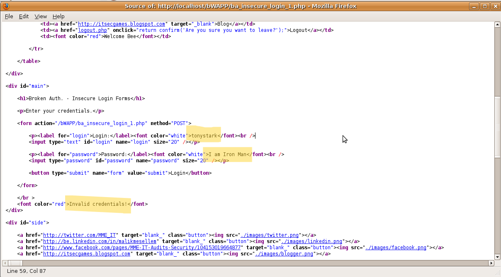
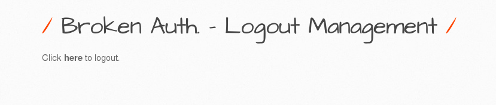
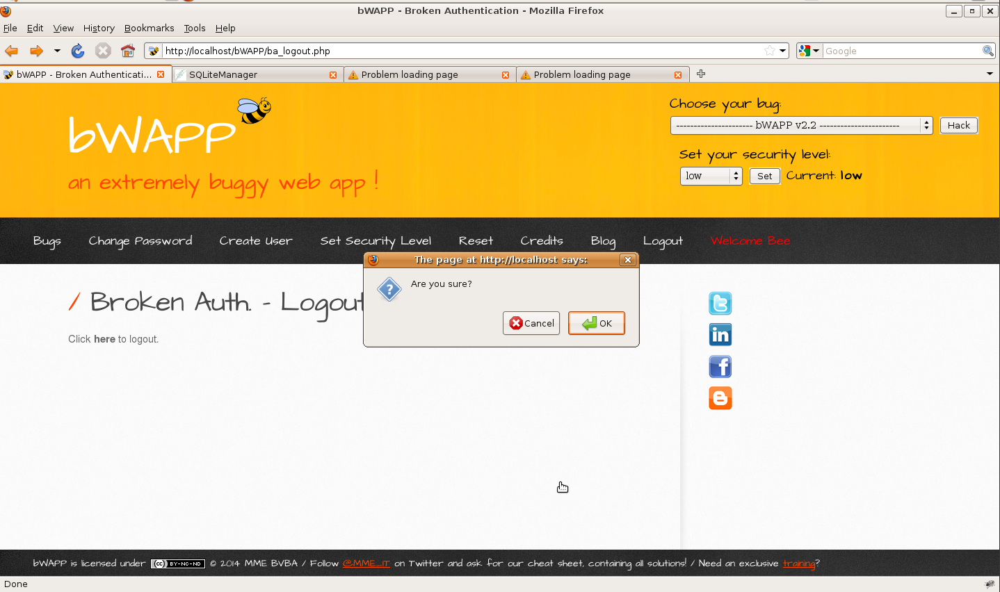
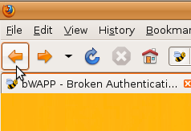

# `02` Identification & authentication failures - Broken Authentication

Broken authentication is a critical security vulnerability that arises when web applications do not properly manage user authentication. It can allow attackers to compromise accounts, steal credentials, or access sensitive information without authorization.

## **Insecure Login Forms**

1. Select the vulnerability **Broken Authentication/Insecure Login Forms** and click "Hack." You will be redirected to a form view where you can attempt to log in with any data, but it will return an `Invalid credentials!` message.
2. Right-click on the page and select **View Page Source** from the menu. This will open a new tab displaying the HTML file.
3. Locate the login form and review the values, where you will see that the username is `tonystark` and the password is `I am Iron Man`, which initially results in an "Invalid credentials" message.

    

4. Use these credentials (username: `tonystark`, password: `I am Iron Man`)—if there is broken authentication, the system will confirm that the user has logged in successfully and display a message.

    

> ⚠ The credentials are embedded directly in the HTML source code of the login page, which is a significant vulnerability. By viewing the source code, an attacker can exploit these embedded credentials, access the system, and potentially gain unauthorized access to sensitive information or user accounts. This illustrates how poor implementation of authentication mechanisms can lead to security breaches.

## Logout Management

1. Select the vulnerability **Broken Authentication/Logout Management** and click "Hack." You will be redirected to a view with a message that says **"Click to Logout"**.

    

2. Click on this message. A prompt will ask you to confirm the logout.
3. Click `OK`, and you will be redirected to a login form, indicating that you have apparently logged out successfully.

    

> 💡 However, if you use the option to go back to the previous page (by pressing the "back" arrow in your browser), you will see that you are returned to the page you were on before logging out, with full access to the authenticated account, demonstrating that the logout was not successful.

    

> ⚠ When the system does not properly invalidate the user's session after logging out, critical vulnerabilities arise. Although the user appears to have logged out, the server does not effectively invalidate the session, exposing the possibility for attackers to gain unauthorized access to the account, especially on a shared device where the previous user did not properly log out.

