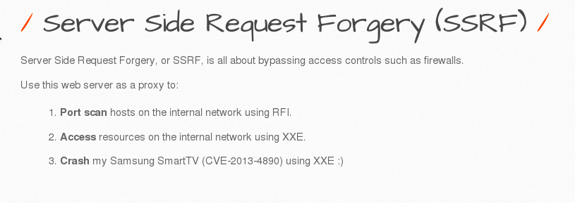
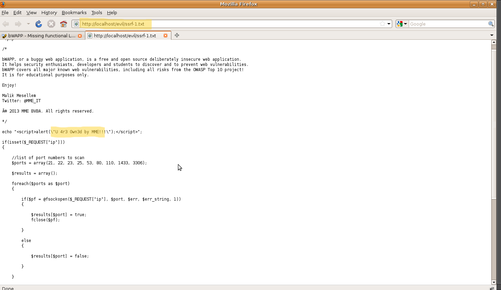
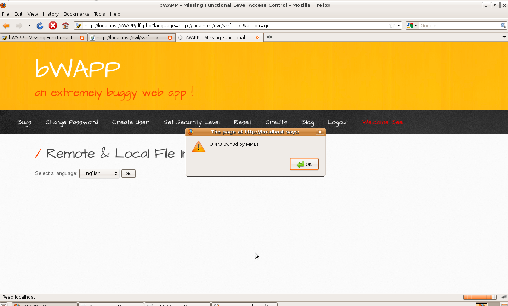

# `06` Server side request forgery - Server site request

**Server-Side Request Forgery (SSRF)** is a vulnerability where an attacker can manipulate a vulnerable server to make requests on their behalf to other resources, both internal and external. This behavior is particularly dangerous when used to perform port scans on the internal network. In the following exercise, we will combine elements of Server-Side Request Forgery (SSRF) and Remote/Local File Inclusion (RFI/LFI) to perform a port scan on the internal network, using the RFI/LFI lesson as a vector for this exploitation.

- ### Port Scanning

1. Select the **Server-Side Request Forgery (SSRF)** vulnerability for the guided activity and click "Hack."
2. Upon starting the SSRF lesson, you will be redirected to a page that allows you to perform a port scan on a server.

    

3. In the port scanning window, enter an internal URL, such as `http://localhost/evil/ssrf-1.txt`, to see if the server can access internal resources.

    > **Note**: Instead of `localhost`, you can also use the server's IP address or hostname, such as `http://localhost/evil/ssrf-1.txt` or `http://<your-ip-address>/evil/ssrf-1.txt`, depending on your network and server configuration.

    

- ### Manipulating the RFI/LFI Lesson

1. In a new browser tab, open the [Remote & Local File Inclusion (RFI/LFI)](../05-security-misconfiguration-LFI/README.md) lesson in bWAPP. The URL will be: http://localhost/bWAPP/rlfi.php

2. Click "Go" to execute the default functionality.


- ### Exploiting SSRF by Modifying the URL

1. In the resulting URL (`http://localhost/bWAPP/rlfi.php?language=lang_en.php&action=go`), remove the `lang_en.php` value and replace it with:

    ```bash
    http://localhost/evil/ssrf-1.txt
    ```

    > 💡 After modification, the URL should look like: `http://localhost/bWAPP/rlfi.php?language=http://localhost/evil/ssrf-1.txt&action=go`

2. Press Enter to execute the request with the modified URL.
3. Check the results. If the exploitation was successful, you will see the results of the port scan or any other internal resource on the screen.

    

Observe how the server has been manipulated to make requests to itself or other internal services, allowing information about the infrastructure to be obtained. This demonstrates how a misconfigured server can be used as an intermediary to access internal resources and compromise an organization's security.


If you achieved the expected results, congratulations! Move on to the next lesson. `-->`
