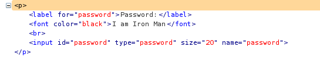
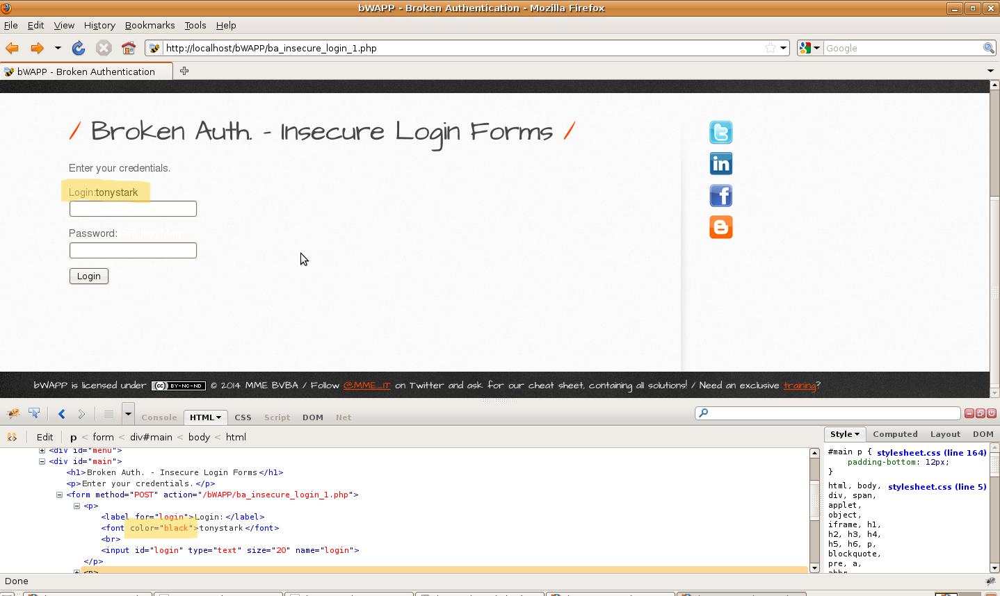
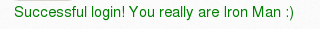

# `07` Insecure Design - Login Page

Este ejercicio simula un diseño inseguro utilizando la vulnerabilidad de Broken Authentication en bWAPP para demostrar cómo un sistema sin controles de seguridad adecuados puede ser comprometido. Aunque la vulnerabilidad **Insecure Design** no está listada explícitamente en bWAPP, se puede replicar con esta vulnerabilidad para ilustrar cómo la falta de seguridad en el diseño puede llevar a problemas críticos.

1. Selecciona la vulnerabilidad **Broken Authentication - Login Page** para la actividad guiada y haz clic en "Hack". Serás redirigido a una página de inicio de sesión sin medidas de seguridad adecuadas.
2. Inspecciona los elementos de la página utilizando las herramientas de desarrollador del navegador. Abre el inspector de elementos de tu navegador y localiza los campos de entrada. (input) del formulario de autenticación.
3. Cambia el color del campo de entrada de las credenciales a negro para poder visualizar los datos de autenticación ocultos.

Al modificar el color del input, podrás ver que las credenciales del usuario **tonystark** con la contraseña **"I am Iron Man"** están visibles.

4. Explotemos del diseño inseguro. Intenta iniciar sesión con esas credenciales. Deberías poder acceder al sistema sin restricciones, lo que muestra la falta de medidas de seguridad como el cifrado de datos sensibles y mecanismos de autenticación robustos.

Con este paso a paso hemos aprendido a identificar y explotar una vulnerabilidad relacionada con **Insecure Design** a través de un diseño débil en la autenticación de usuarios. Esta vulnerabilidad destaca la importancia de considerar la seguridad desde la fase de diseño, ya que un mal diseño no puede ser corregido simplemente con la implementación de parches.

Si lograste los resultados esperados, ¡felicitaciones! ve a la siguiente leccion `-->`

