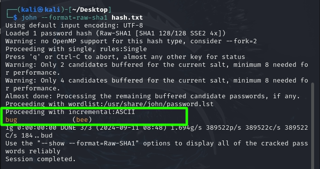

# `08` Cryptographic Failures - Weak Password Hashing. 

A weak implementation of password hashing represents a critical vulnerability of **cryptographic failures**, since instead of storing passwords in plain text, they should be hashed (converted to a non-reversible value using a cryptographic algorithm) before being stored in a database. However, if weak or inadequate hash algorithms are used, such as MD5 or SHA-1 (which are no longer secure), attackers can easily crack them using techniques like dictionary attacks or brute force.

Through this exercise, we will identify the vulnerability using SQL Injection to obtain password hashes from the database and exploit cryptographic failures by cracking the hashes with tools like **John the Ripper**. Afterward, we will log in with the obtained passwords to demonstrate the vulnerability.

## Obtaining Password Hashes

1. Select the **SQL Injection (GET/Search)** vulnerability and click "Hack".
2. As we did in the [SQL injection](../03-injection-sqlinjection/README.md) exercise, explore the vulnerable form. You will see a form with a field to enter a search query (usually named `title` or `id`).

3. Based on what you learned in the [SQL injection](../03-injection-sqlinjection/README.md) exercise, enter a payload to retrieve the current user's name:

```bash
http://<your_ip>/bWAPP/sqli_1.php?title=test' UNION SELECT 1, 2, user(), 4, 5, 6, 7-- &action=search
```

If you get the username as a result, the application is vulnerable.

4. Extract password hashes. Use an advanced SQL injection to extract sensitive data (usernames, passwords) as we did in SQL injection.

> 💡 Hint: Usernames are stored in the login column, keep this in mind when retrieving the usernames.


### Cracking the Hashes

1. Create a file called `hash.txt` with the following format (adjust it based on the hash you have obtained):

```bash
bee:202cb962ac59075b964b07152d234b70
```

- **bee** is the username.
- **202cb962ac59075b964b07152d234b70** is the password hash.

2. Use John the Ripper to crack the hash. Run the following command in your terminal, making sure you're in the directory where the file was created:

```bash
john --format=raw-sha1 hash.txt
```

> 💡 You can install John the Ripper on the BeeBox machine, but it might cause some complications, and you could lose a lot of time installing it. Instead, you can use Kali Linux to perform the cracking since it comes with John the Ripper pre-installed. Choose your path wisely.

3. Check the results. If John the Ripper successfully cracks the hash, you will see something like this:




### Log in to bWAPP with the Cracked Password
1. Go to the login form on bWAPP.
2. Enter the username and the cracked password (e.g., bee and 123).
3. Check if you can access the user's account with the obtained credentials.

> ⚠ Mitigating Weak Password Hashing issues is crucial because an attacker who gains access to the password database could gain full control of users' accounts.

If you achieved the expected results, congratulations! Move on to the next lesson -->

