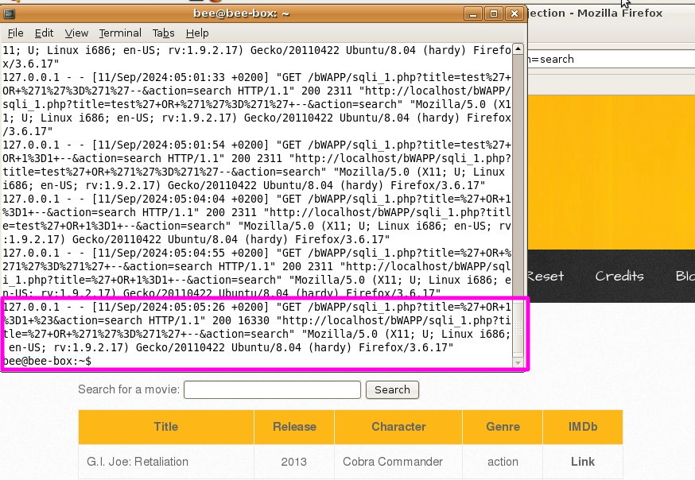

# `09` Security Logging and Monitoring Failures

Security Logging and Monitoring Failures se refiere a la falta de un adecuado registro y monitoreo de eventos críticos en una aplicación. Cuando una aplicación no registra actividades importantes, como intentos de ataque, o no monitorea estos registros de manera efectiva, los atacantes pueden pasar desapercibidos. Esto aumenta el riesgo de que un ataque comprometa la seguridad sin ser detectado.

Dado que ya hemos trabajado con la vulnerabilidad [SQL Injection (GET/Search)](../08-cryptographic-failures/README.es.md), aprovecharemos esto para verificar si la aplicación registra los intentos de inyección SQL. La idea es realizar una inyección SQL y luego investigar si la aplicación registra esos intentos o si carece de un sistema de monitoreo adecuado.

### Verificación de Intentos de SQL Injection en bWAPP

1. Selecciona la vulnerabilidad **SQL Injection (GET/Search)** y "Hack".
2. Realiza un Intento de Inyección SQL. En el campo de búsqueda, introduce el siguiente payload de SQL Injection para probar si la aplicación es vulnerable:

```bash
' OR 1=1 #
```

3. Haz click en el botón de Search. Si la aplicación muestra un resultado diferente o toda la tabla, significa que es vulnerable a la inyección SQL.

### Revisar si la aplicación registra el intento de inyección SQL

Una vez realizada la inyección, debes verificar si la aplicación registra este intento en algún archivo de log o si hay un sistema de monitoreo configurado para detectar esta actividad.

1. Comprueba archivos de Log en el servidor (si son accesibles). En muchos sistemas Linux, los logs del servidor Apache se encuentran en:

```bash
/var/log/apache2/access.log
```
o

```bash
/var/log/apache2/error.log
```
2. Abre estos archivos y busca entradas relacionadas con tu intento de inyección SQL. Si encuentras la entrada con el intento de inyección SQL, el sistema está registrando, pero quizás no esté generando alertas.




> ⚠ Si encuentras registros sin alertas en el sistema, esto indica que, aunque el servidor está registrando las actividades, no está tomando ninguna acción proactiva o preventiva en respuesta a posibles ataques. Este es un problema importante en la categoría de Security Logging and Monitoring Failures, ya que afecta directamente la capacidad de la organización para detectar y responder a amenazas en tiempo real.

Si lograste los resultados esperados, ¡felicitaciones! ve a la siguiente leccion `-->`
